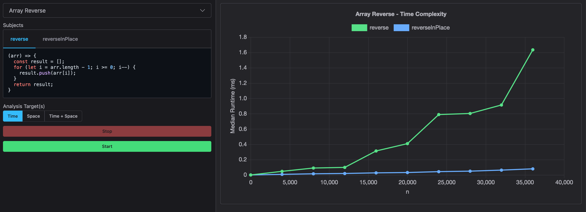

# Asymptotic Analyzer

Command-line tool for analyzing the asymptotic behavior of algorithm implementations. Generates real-time graphs of average runtimes of various functions for pre-defined input sizes allowing you to gain more insights into the runtime performance than a simple benchmarking tool that only runs a single input against a function.



## Usage

1. Install pacakge: `$ npm install --save-dev asymptotic-analyzer`.
2. Define a workbenches file, for example `./test/workbenches.js` (more on that below).
3. Run the script against your workbenches file: `$ npx analyze ./test/workbenches.js`.

## Defining a Workbenches File

You need to create a file which exports the sets of functions you are interested in analyzing, along with functions for generating valid inputs for those functions. Take a look at `./test/workbenches.js` for an example.

The default export in this file must match the following `Workbenches` type:

```ts
type Workbenches = Workbench[];

type Workbench = {
  // The name of the workbench to display in the UI. Must be unique.
  name: string;
  // The functions to analyze.
  subjects: Subject[];
  // A function for generating the next input set.
  generator: Generator<InputSet>;
};

type Subject = (...args: any[]) => any;

type InputSet = { n: Number; inputs: any[] };
```

Here's a simple example:

```js
const copyWithForLoop = (arr) => {
  let result = [];
  for (let i = 0; i < arr.length; i++) {
    result.push(arr[i]);
  }

  return result;
};

const copyWithSpread = (arr) => [...arr];

// Helper for generating a size-n array filled with random values from 0-999.
const generateArray = (n) =>
  Array(n)
    .fill()
    .map(() => Math.floor(Math.random() * 1_000));

export default [
  {
    name: "Array Copy",
    subjects: [copyWithForLoop, copyWithSpread],
    generator: function* () {
      for (let n of [0, 10_000, 20_000, 30_000, 40_000]) {
        yield { n, inputs: [generateArray(n)] };
      }
    },
  },
];
```

## Future Plans

1. Include memory usage analysis.
1. Interactive time complexity estimation.
